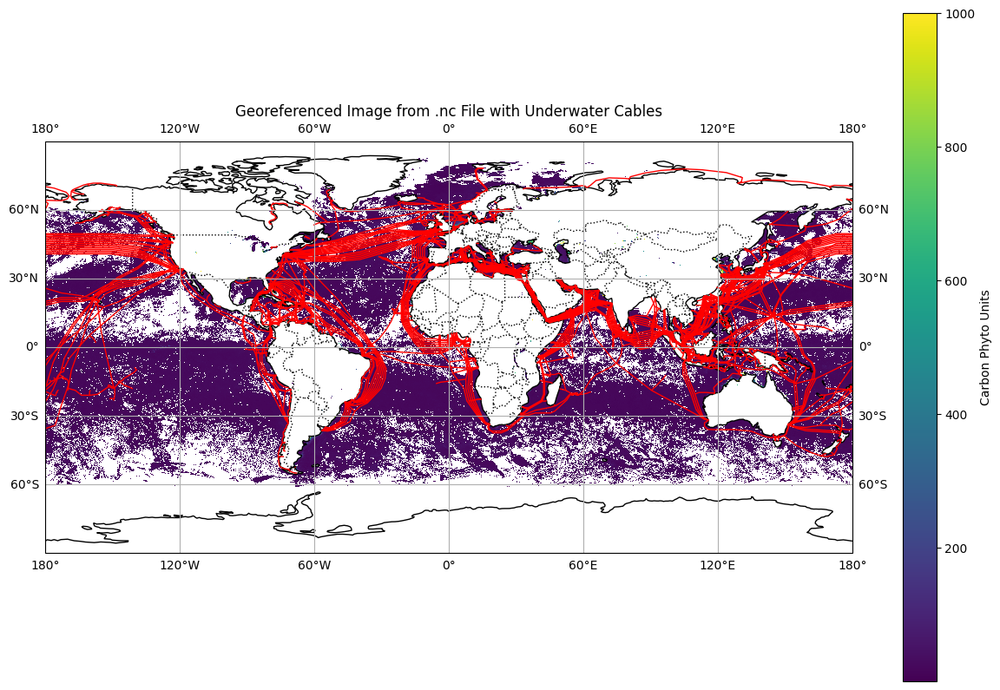

# Here you can find how I turned the RAW data to intereteing images

I started [with PACE NetCDF images](https://pace.oceansciences.or) with an [8 day period](NetCDF/README.md) and based on [Abhishek Mamdapure's Medium post, "How to read and visualize netCDF(.nc) geospatial files using python?"](https://medium.com/analytics-vidhya/how-to-read-and-visualize-netcdf-nc-geospatial-files-using-python-6c2ac8907c7c) and with the help of GitHub Copilot I turned them into images.

I added Shipping lanes from based on CIA's [georeferred map](Shipping_Lanes_v1.geojson), [Benden, P. (2022). Global Shipping Lanes [Data set]. Zenodo. https://doi.org/10.5281/zenodo.6361763](https://github.com/newzealandpaul/Shipping-Lanes).

And unfortunatly the Underwater internet cables's [geojson](underwatercable.json) wasn't hosted on the [original github repo](https://github.com/delusan/www.submarinecablemap.com), so I had to get it from [the archive](https://web.archive.org/web/20220429043145/https://raw.githubusercontent.com/telegeography/www.submarinecablemap.com/master/web/public/api/v3/cable/cable-geo.json).

